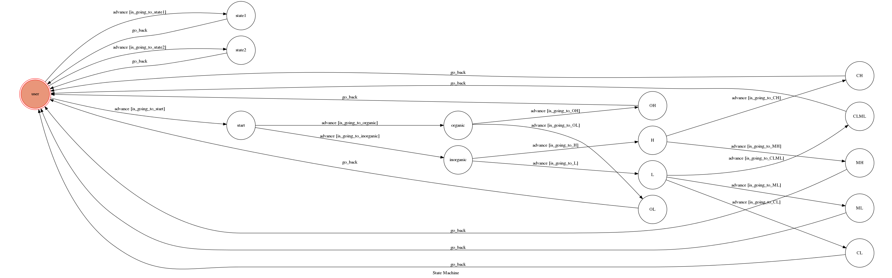

# TOC-Project-2017

Telegram chatbot about Unified Soil Classification System.

### Finite State Machine

### Usage

The initial staet is set to `user`.

Every time `user` state is triggered to `advance` to `state1` and `state2`, it will `go_back` to `user` state after the bot replies corresponding message.

If the bot reply "The soil is (symbal)", then it will `go_back` to `user` state after the bot replies corresponding message.

* user
  * Input: "1" or "UCUS introduction"
    * Reply: "USCS is Unified Soil Classification System. It is used to classify soil for civil engineering by physical properties of soil."
    
  * Input: "2" or "Symbol meaning"
    * Reply: "USCS is Unified Soil Classification System. It is used to classify soil for civil engineering by physical properties of soil."
    
  * Input: "3" or "start to classify"
    * Reply: "Is the soil organic or inorganic?"
    * next state: "start"
    
* start
  * Input: "organic" or "inorganic"
    * Reply: "What is the liquid limit?"
    
* organic
  * Input: an integer(LL)
    * Reply: "What is PI?"
    * Next state: "L" or "H"

* inorganic
  * Input: an integer
    *Reply: "The soil is OL." or "The soil is OH."
    
* L/H
  * Input: an integer(PI)
    * Reply: "The soil is CL." , "The soil is CL-ML." , "The soil is ML." , "The soil is CH." or "The soil is MH."

### Execution

* get http:
  1. download ngrok
  2. execute `./ngrok http 5000`
  3. copy Forwarding, ex: 'https://1e693045.ngrok.io'
  4. paste to file 'app.py', replace `https://1e693045.ngrok.io` in line 11.

* compile and execution
  1. `python3 app.py`
  2. open telegram bot "土壤分類"
  3. send messange and start

